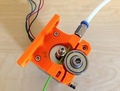
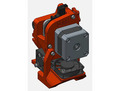
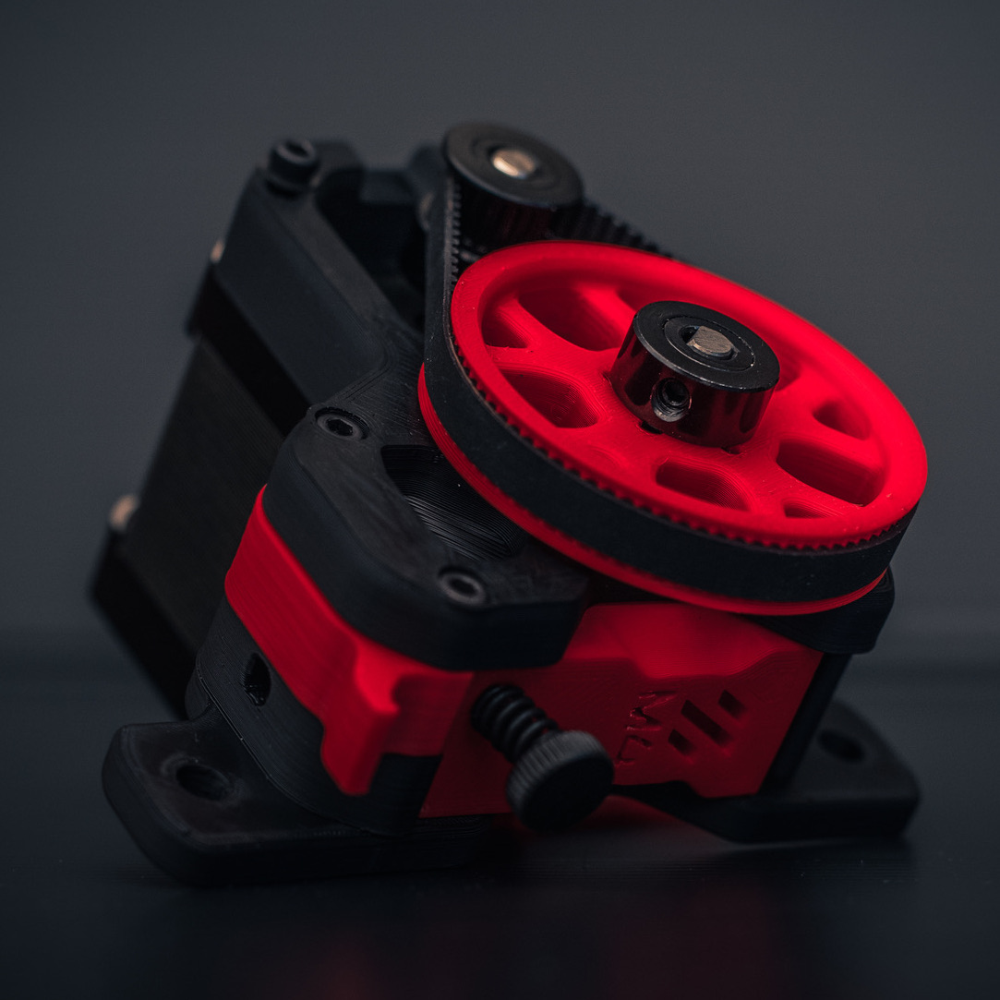

# Azro 3D

This is my personel 3D printer diy project with **Azro** code name.

- [MKS Tiny Bee](https://github.com/makerbase-mks/MKS-TinyBee) board
- [BOM](bom.md) list

| Part                                   | Link                                                                                     |
|:--------------------------------------:|:---------------------------------------------------------------------------------------- |
|  | [Compact Bowden Extruder, direct drive 1.75mm](https://www.thingiverse.com/thing:275593) |
|  | [ReDuplicator i3 MK3x - Wanhao i3 Complete Aluminium Extrusion & Prusa Mk3 Overhaul](https://www.thingiverse.com/thing:2686588) |
|  | [Prusa i3 MK2 Upgrade kit for E3D Titan Extruder by S±E](https://www.thingiverse.com/thing:2065461) |
|  | [Voron M4 Extruder](https://vorondesign.com/voron_m4) |
|  | [Voron STEALTHBURNER](https://vorondesign.com/voron_stealthburner) |

### Referances
[thingiverse.com](https://www.thingiverse.com/thing:5140212/files)
[printables.com](https://www.printables.com/model/87242-me-mini-3d-printer/files)

### Note
PLA: 180-210 °C
ABS: 200-250 °C
PET: 215-230 °C
TPE: 210-240 °C  
PVA: 160-190 °C  
TPU: 230-250 °C

