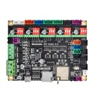

# Bom list

| img                              | Designation                                                       | Qte | Manifacturer                                                                                                                           | Price DZD | Price DZD | Sts |
|:--------------------------------:|:------------------------------------------------------------------|:---:|:---------------------------------------------------------------------------------------------------------------------------------------|----------:|----------:|:---:|
|             | Stepper Motor Nema 17                                             | 4   | [evolutronics](https://www.ouedkniss.com/store/11258/evolutronics/annonce/21635423)                                                    |   2700.00 |      0.00 | ✓   |
|             | V-Slot 20x40 1M                                                   | 1   | [evolutronics](https://www.ouedkniss.com/store/11258/evolutronics/annonce/25273357)                                                    |   2100.00 |   2100.00 | ✓   |
|           | Coupler 5x8x25mm fot stepper motor                                | 1   | [dzduino](https://www.dzduino.com/store-en/cnc-3d-printers-en/stepper-motor-5x8x25mm-coupling-coupler-blue-en)                         |    350.00 |           |     |
|             | Linear bearing                                                    | 7   |                                                                                                                                        |      0.00 |           |     |
|             | Belt timing GT2 6mm                                               | 1   | recuperation                                                                                                                           |    500.00 |      0.00 | ✓   |
|             | Belt timing GT2 8mm                                               | 1   | recuperation                                                                                                                           |    500.00 |      0.00 | ✓   |
|              | GT2 Timing Pulley 10mm                                            | 2   | dzinotech                                                                                                                              |    500.00 |           |     |
|              | Timing pulley T16-2GT                                             | 2   |                                                                                                                                        |      0.00 |           |     |
|             | Smooth rod 8mm                                                    | 4   |                                                                                                                                        |      0.00 |           |     |
|             | Smooth rod 10mm                                                   | 2   |                                                                                                                                        |      0.00 |      0.00 | ✓   |
|  | Vis a bille 300mm ACME LEADSCREW+T8 NUT                           | -   | [evolutronics](https://www.ouedkniss.com/store/11258/evolutronics/annonce/25242881)                                                    |   1900.00 |           |     |
|         | T Nut M5                                                          | -   | evolutronics                                                                                                                           |     25.00 |    250.00 | ✓   |
|           | 20x20 corner                                                      | -   | [dzduino](https://www.dzduino.com/store-en/cnc-3d-printers-en/cast-corner-bracket-for-cnc-imprimante-3d-en)                            |    100.00 |           |     |
|             | SCREWS M5 6mm                                                     | -   | dzduino                                                                                                                                |      6.00 |           |     |
|             | SCREWS M5 8mm, 10mm                                               | -   | dzduino                                                                                                                                |     15.00 |    210.00 | ✓   |
|         | Extruder                                                          | 1   | dzinotech                                                                                                                              |   2500.00 |           |     |
|        | 12V J-HEAD WITH FAN 1.75MM + Hotend PTFE tube + 2 PC4-M6 PNEUMATIC STRAIGHT FITTING | 1 | evolutronics                                                                                                           |   2500.00 |   2500.00 | ✓   |
|           | LJ8A3-2-Z/AX-5V-36V INDUCTIVE PROXIMITY SENSOR SWITCH M8, NPN NC  | 1   | [dzduino](https://www.dzduino.com/store-en/cnc-3d-printers-en/lj8a3-2-zax-5v-36v-inductive-proximity-sensor-switch-m8-npn-nc-en)       |   1000.00 |           |     |
|             | Y-carriage                                                        | 1   | dzinotech                                                                                                                              |   2200.00 |           |     |
|             | Heat Bed MK2B                                                     | 1   |                                                                                                                                        |           |           |     |
|         | Flex Bed                                                          | 1   |                                                                                                                                        |           |           |     |
|             | glass                                                             | 1   |                                                                                                                                        |           |           |     |
|             | clips                                                             | 1   |                                                                                                                                        |           |           |     |
|             | Print parts                                                       | 9   |                                                                                                                                        |   1900.00 |   1900.00 | ✱   |
|           | Board Makerbase MKS Tiny Bee                                      | 1   | [Aliexpress](https://www.aliexpress.com/item/1005003822446877.html?spm=a2g0o.productlist.0.0.1949466f1zKmyK&algo_pvid=30fb50c6-a9e9-4e79-9120-623391d303ac&algo_exp_id=30fb50c6-a9e9-4e79-9120-623391d303ac-26&pdp_ext_f=%7B%22sku_id%22%3A%2212000029928588228%22%7D&pdp_npi=2%40dis%21USD%2116.24%2112.99%21%21%21%21%21%4021135c2b16645576484607977ebb50%2112000029928588228%21sea&curPageLogUid=24ow9882g5oc) | $ 42.72 |  |  |
**✓** done.  
**✱** in progress.  
**x** none.  
